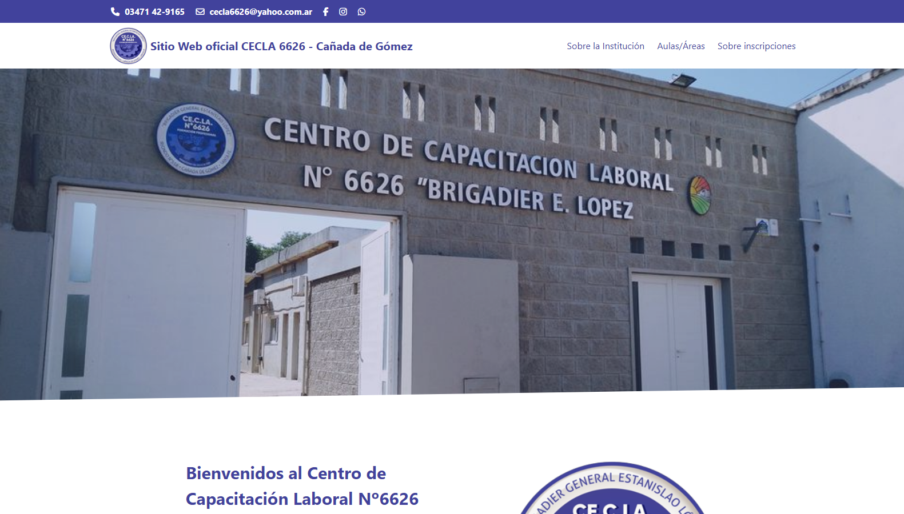

  

---

# CECLA 6626

"CECLA 6626" is a modernized version of the existing website of the Labor Training Center 6626, Brigadier General Estanislao López (CECLA 6626), leveraging Astro and Tailwind to enhance both user experience (UX) and user interface (UI). This renovation focuses on providing a more intuitive, modern, simple, and user-friendly design compared to the original. Key features include a streamlined homepage, a better-organized course catalog, and a clearer presentation of enrollment information overall.

You can <a href="https://www.youtube.com/watch?v=JaWBVzGBzH8" target="_blank">**click here**</a> to see an overview of the page.

## Features

- Intuitive user interface makes navigation easy for all users.
- Modern and attractive design provides a more pleasant and updated visual experience.
- Access a simplified home page and a better organized course catalog for a smoother, hassle-free user experience, especially when it comes to information.

## Technologies Used

- <a href="https://astro.build/" target="_blank">**Astro**</a>: A modern static site generator that brings performance and developer experience to the forefront, offering a seamless and efficient development process.
- <a href="https://react.dev/" target="_blank">**React**</a>: A JavaScript library for building interactive user interfaces. In this context, is used to contribute the creation and management of interactive components, acting as "islands" within a static environment such as Astro.
- <a href="https://tailwindcss.com/" target="_blank">**Tailwind CSS**</a>: A utility-first CSS framework that simplifies styling by providing low-level utility classes, enabling a straightforward and fast approach to building modern and responsive interfaces.

## Project Structure

- `public/assets`: Contains static assets such as images and icons used in the application.
- `src/components`: Contains reusable components used in different parts of the application.
- `src/pages`: Contains all the pages within the application.
- `src/data`: It contains data files used in the application, such as the different courses offered by the institute.
- `src/layouts`: Contains files where the general structure of the sections or pages of the application is defined, acting as a template to achieve visual coherence.

## Authors

- Matías Gonta

If you have any questions, concerns or interest, feel free to contact me.

---

  

---

# CECLA 6626

"CELA 6626" es una versión modernizada del sitio web existente del Centro de Capacitación Laboral 6626, Brig Gral. Estanislao López (CECLA 6626), utilizando Astro y Tailwind para mejorar tanto la experiencia del usuario (UX) como la interfaz (UI). Esta renovación se centra en ofrecer un diseño más intuitivo, moderno, simple y amigable en comparación con el original. Las características clave incluyen una página de inicio simplificada, un catálogo de cursos mejor organizado y una presentación más clara de la información de inscripción en general.

Puedes hacer <a href="https://www.youtube.com/watch?v=JaWBVzGBzH8" target="_blank">**clic aquí**</a> para una visión general de la página.

## Características

- Interfaz de usuario intuitiva que facilita la navegación para todos los usuarios.
- Diseño moderno y atractivo que proporciona una experiencia visual más agradable y actualizada.
- Accede a una página de inicio simplificada y un catálogo de cursos mejor organizado para una experiencia de usuario más fluida y sin complicaciones, especialmente en cuanto a la información.

## Tecnologías utilizadas

- <a href="https://astro.build/" target="_blank">**Astro**</a>: Un moderno generador de sitios estáticos que pone el rendimiento y la experiencia del desarrollador en primer plano, ofreciendo un proceso de desarrollo fluido y eficiente.
- <a href="https://react.dev/" target="_blank">**React**</a>: Una biblioteca de JavaScript para crear interfaces de usuario interactivas. En este contexto, se utiliza para contribuir a la creación y gestión de componentes interactivos, actuando como "islas" dentro de un entorno estático como lo es Astro.
- <a href="https://tailwindcss.com/" target="_blank">**Tailwind CSS**</a>: Un framework de CSS centrado en las utilidades, que simplifica el estilo al proporcionar clases de utilidades de bajo nivel, lo que permite un enfoque sencillo y rápido para crear interfaces modernas y responsivas.

## Estructura del proyecto

- `public/assets`: Contiene activos estáticos como imágenes e iconos utilizados en la aplicación.
- `src/components`: Contiene componentes reutilizables utilizados en diferentes partes de la aplicación.
- `src/pages`: Contiene todas las páginas dentro de la aplicación.
- `src/data`: Contiene archivos de datos utilizados en la aplicación, como los diferentes cursos que ofrece el instituto.
- `src/layouts`: Contiene archivos donde se define la estructura general de las secciones o páginas de la aplicación, actuando como plantilla para lograr coherencia visual.

## Autores

- Matías Gonta

Si tiene alguna pregunta, inquietud o interés, no dude en ponerse en contacto conmigo.
